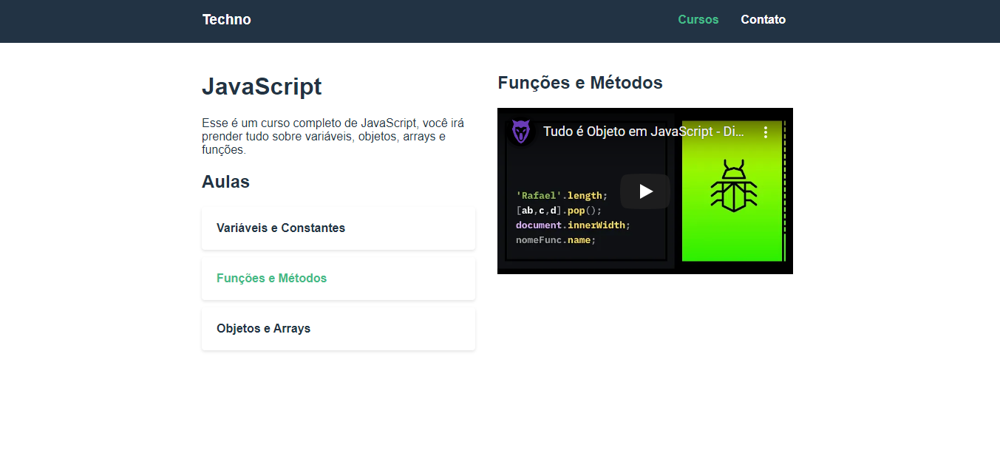

# techno-cursos
<p>Pequeno projeto realizo no curto de vue.js origamid para estudar vue-router.</p>
<p>Para usabilidade abaixar  json-server e executar api.json que está na raiz do projeto.</p>

## Project setup
```
yarn install
```

### Compiles and hot-reloads for development
```
yarn serve
```

### Compiles and minifies for production
```
yarn build
```

### Lints and fixes files
```
yarn lint
```


<br />


<br />



